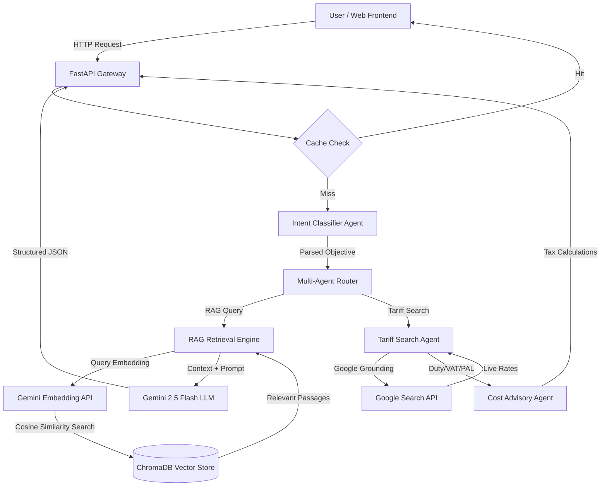
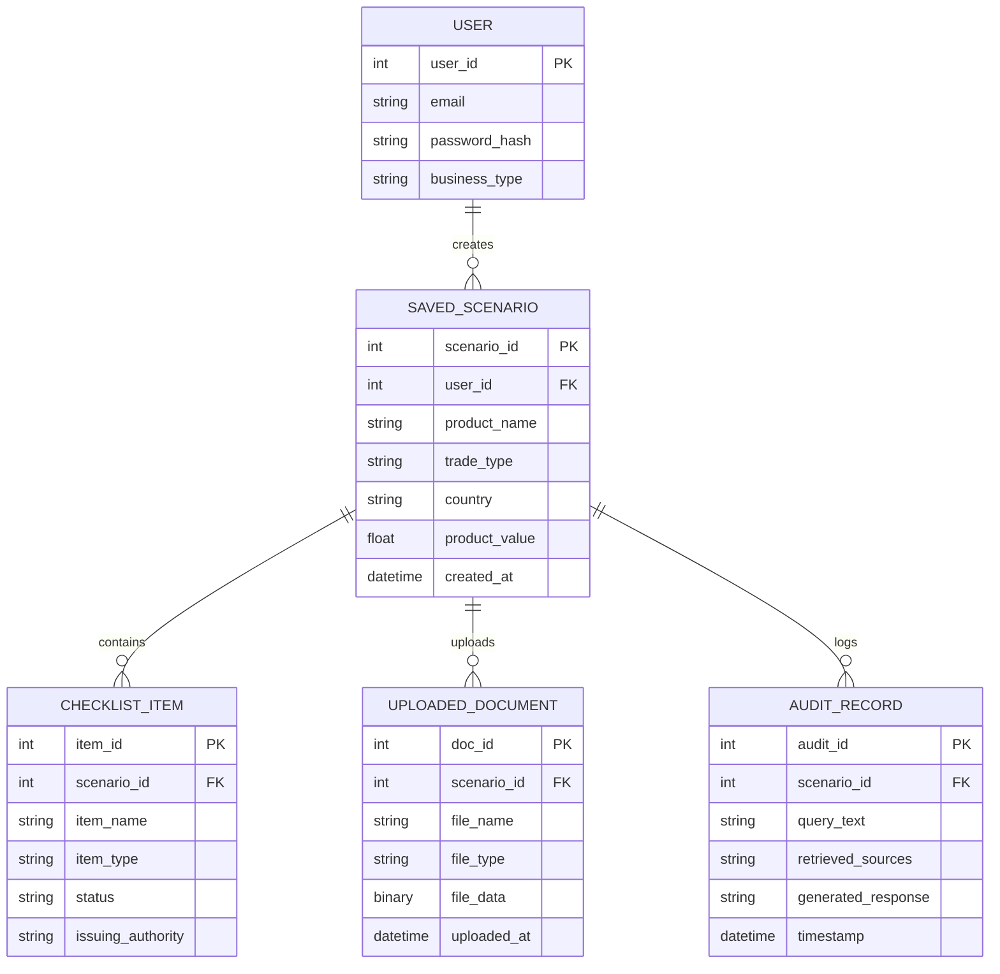

# 🚢 TradePilot AI - Final Submission Report
### RAG-Powered Multi-Agent System for Sri Lanka Trade Compliance and Automation

---

## 1. Problem Statement
International trade is a critical driver of Sri Lanka's economy, yet small and medium enterprises (SMEs), startup founders, and first-time traders face significant hurdles when importing or exporting goods. Sri Lanka's trade compliance landscape is characterized by:
* **Regulatory Fragmentation**: Importers and exporters must navigate rules spanning multiple government entities, including Sri Lanka Customs, the Department of Import and Export Control, the Sri Lanka Standards Institution (SLSI), and agricultural licensing departments.
* **Complex Tariff Schedules**: Identifying correct Harmonized System (HS) Codes and calculating multi-layered customs duties, Value Added Tax (VAT), and Ports and Airport Development Levy (PAL) is highly technical and prone to calculation errors.
* **Severe Compliance Risks**: Incorrect documentation or failure to obtain pre-shipment permits leads to severe shipping delays, cargo holds, expensive demurrage fees, and heavy financial penalties.
* **High Brokerage Costs**: Access to reliable trade compliance information is gatekept by customs house brokers, making compliance analysis expensive and slow for early-stage businesses.

---

## 2. Proposed Solution
**TradePilot AI** is an advanced, RAG-powered multi-agent system that democratizes access to trade compliance. By translating natural language trade queries (e.g., *"I want to export Ceylon Cinnamon to the UK"*) into structured roadmaps, checklists, risk profiles, and cost calculations, it acts as a virtual trade consultant. 

### Key Innovations:
1. **Fact-Grounded RAG Pipeline**: Ensures all compliance guidance is cross-referenced with a local database of official circulars, gazettes, and guidelines, mitigating Large Language Model (LLM) hallucinations.
2. **Cooperative Multi-Agent Orchestration**: Deploys 12 specialized AI agents, each handling a discrete domain of the compliance cycle.
3. **Live Google Grounding**: Falls back to live Google Search grounding to retrieve real-time tariff updates for codes missing from static databases.
4. **Self-Ingesting Custom Documents**: Enables users to upload custom PDF files (invoices, certificates, new circulars) and chat with them dynamically under local trade rules.

---

## 3. Usage of AI Agents
TradePilot AI divides complex trade procedures among 12 specialized AI agents operating under a collaborative hierarchy:

| Agent Name | Primary Responsibility | Input / Trigger | Output / Impact |
| :--- | :--- | :--- | :--- |
| **1. Intent Agent** | Gateway parser and route classifier. | Natural language user query. | Structured JSON mapping to specific downstream agent targets. |
| **2. Compliance Agent** | General regulatory compliance checker. | Trade scenario details. | Prohibitions, restrictions, and licensing obligations. |
| **3. Workflow Agent** | Operational planner. | Trade scenario & RAG context. | Step-by-step sequential operations roadmap. |
| **4. Checklist Agent** | Document checklist manager. | Trade scenario details. | Interactive checklists mapped to frontend task lists. |
| **5. Risk Agent** | Safety officer and audit checker. | Trade scenario & local docs. | Flags missing items, customs hold risks, and rejections. |
| **6. Document Suggestion Agent**| Regulatory document compiler. | Product type & route. | List of mandatory paperwork with regulatory justifications. |
| **7. Document Verification Agent**| Compliance auditor. | Provided documents vs requirements. | Gap analysis highlighting missing permits or approvals. |
| **8. Agency Recommendation Agent**| Authority mapper. | Product type & route. | Recommended government departments (SLSI, Customs, etc.). |
| **9. Cost Advisory Agent** | Financial estimator coordinator. | Product, country, and value. | Aggregated cost summaries and tax breakdowns. |
| **10. HS Code Agent** | Classification assistant. | Product name/description. | Verified 4-digit or 8-digit HS Code candidates. |
| **11. Tariff Search Agent** | Real-time grounding researcher. | HS Code and product name. | Live Duty, VAT, and PAL rates retrieved via Web Search. |
| **12. Chat Agent** | Conversational PDF assistant. | Uploaded documents & user prompts. | ChatGPT-like conversational trade compliance consultation. |

---

## 4. API Handling & Architecture
The system exposes a highly organized REST API built with FastAPI. Routes are modularly structured inside the `backend/routes/` folder.

### Key API Endpoints:
- `POST /api/intent`: Intakes natural language and determines classification.
- `POST /api/compliance`: Checks if products are restricted/prohibited.
- `POST /api/workflow`: Returns step-by-step roadmap.
- `POST /api/risk`: Evaluates risk categories and mitigation guidelines.
- `POST /api/cost-estimation`: Takes product value and outputs absolute tax breakdowns.
- `POST /api/chat/upload`: Extracts PDF/text contents and indexes them into the vector database.
- `POST /api/chat/chat`: Performs conversational queries against the vector store with message history.

### Optimization & Caching:
* **Caching Layer**: Utilizes a persistent JSON-based caching mechanism to save previous calculations and requests, reducing LLM token consumption and improving response times for identical queries.
* **Pydantic Validation**: All requests and responses are strictly validated using Pydantic models (defined in the route files), ensuring robust type checking and data security.

---

## 5. Technology Stack Used
* **Backend Framework**: Python FastAPI (Asynchronous, type-safe REST API server)
* **LLM Engine**: Google Gemini 2.5 Flash
* **Vector Database**: ChromaDB (Vector store storing embedded regulatory circulars)
* **Embedding Model**: `models/gemini-embedding-2` (768-dimensional text vectors)
* **Web Search Grounding**: Google Search Tool integration via `google-genai` SDK
* **PDF Processing**: `pypdf` for parsing document uploads
* **Frontend**: HTML5, Vanilla CSS, and JavaScript (with clean glassmorphic components)

---

## 6. Assumptions & Prototyping Details
During prototype development, the following assumptions and design decisions were made:
1. **Regulatory Scope**: The system focuses strictly on Sri Lankan trade routes (Imports into Sri Lanka, Exports out of Sri Lanka).
2. **Synthetic Data for Simulation**: Because official government circular databases are not available via open APIs, **synthetic compliance documents and sample cases** (e.g. cinnamon export guides, electronics import rules) were generated and indexed into ChromaDB. This simulates the behavior of a comprehensive RAG pipeline with high fidelity.
3. **Estimation Only**: All cost and timeline outputs are advisory estimates and not legally binding.
4. **Authentication Baseline**: Prototype sessions assume a single trader/admin session for checklist tracking, with mock databases simulating saved user profiles.

---

## 7. Diagrams

### A. System Architecture Diagram
The diagram below shows the flow of a query from the Client UI down to the Multi-Agent Router, the RAG Retrieval engine, and the external API integrations.



### B. Use Case Diagram
This diagram outlines the core actions performed by the Trader (Primary Actor), the Consultant (Secondary Actor), and the Admin, interacting with the system boundaries.

```mermaid
left-to-right direction
actor Trader as "Trader (Primary)"
actor Consultant as "Trader Consultant"
actor Admin as "Admin"

rectangle "TradePilot AI System" {
    usecase UC1 as "Submit Trade Query"
    usecase UC2 as "Analyse Query Intent"
    usecase UC3 as "Generate Process Roadmap"
    usecase UC4 as "Identify Permits & Compliance"
    usecase UC5 as "Generate Document Checklist"
    usecase UC6 as "Estimate Cost & Timeline"
    usecase UC7 as "Assess Compliance Risk"
    usecase UC8 as "View Readiness Report"
    usecase UC9 as "Track Checklist Progress"
    usecase UC10 as "Upload Custom PDF & Chat"
    usecase UC11 as "Update Knowledge Base"
    
    UC1 .> UC2 : <<include>>
    UC2 .> UC3 : <<include>>
    UC3 .> UC4 : <<include>>
    UC4 .> UC5 : <<include>>
    UC5 .> UC8 : <<include>>
    
    Trader --> UC1
    Trader --> UC8
    Trader --> UC9
    Trader --> UC10
    
    Consultant --> UC7
    Consultant --> UC8
    
    Admin --> UC11
}
```

### C. Entity Relationship (ER) Diagram
The database schema manages user accounts, scenarios, checklists, uploaded files, and compliance audit records.


